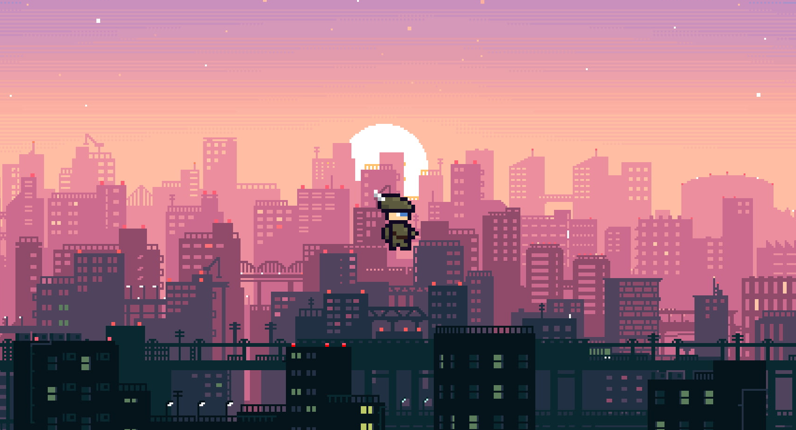

# Documentation

### Collaboration
This game is made in collaboartion with @chipsfilip as a school project in our first year at KTH.

### Theme
A top down roguelite adventure game where you are a young elfen boy and you have to find your way home. Though, to get home, you will have to encounter and overcome the enemies in your way.

### How to win/lose
You can win by defeating the boss in the Dark Forest and get home. The game can however also be lost if you get yourself killed. To increase your chances of survival, you can aquire better gear by either killing enemies or by hard (fishy) work.

### MVP
Display a room in which you can move around in.

### How to run and install the game
To install the game you simply download the Elfen Lost.jar file from the map called game. Then to run it, you click on the file and the game will start. Though, keep in mind that you will need to have Java installed on your computer for the program to run.

### Code syntaxing
* Write curly brackets after one space. Example: `public int height() {`
* Use tab size 4 for indentaion 
* Use JavaDoc for documentation

### Code information
We will write this game using Java with the help of the framework libGDX. The game's sprites will be made by us using Aseprite.

### Limitations
Below are various limitations so that the game doesn't get too complicated
* No audio
* Low resolution/low pixel sprites (8-16 bit style)
* Pre-programmed world creation (hard coded), non editable world
* No object collision, only map border collision for going into next room
* No seperate combat screen (combat also in top down screen)
